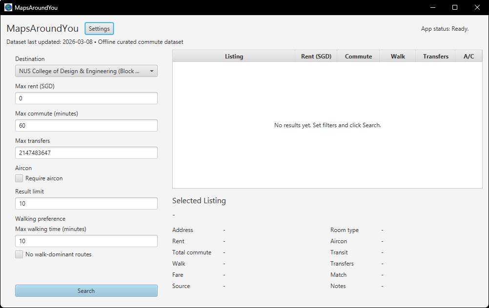
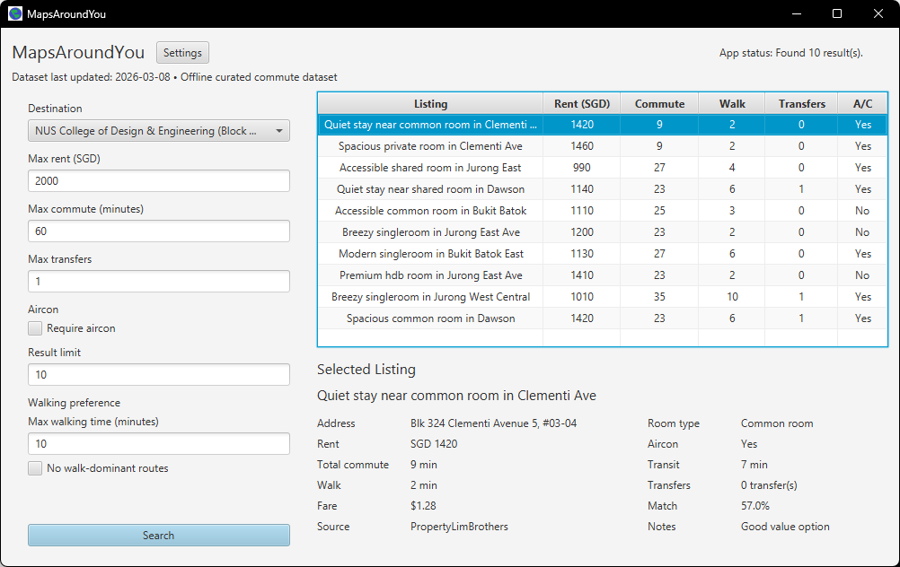
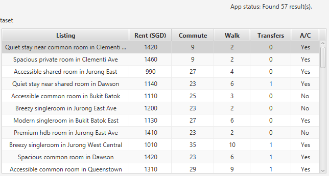
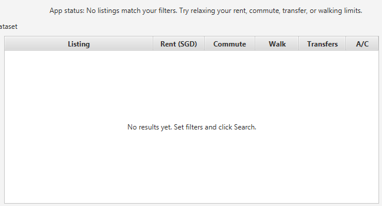
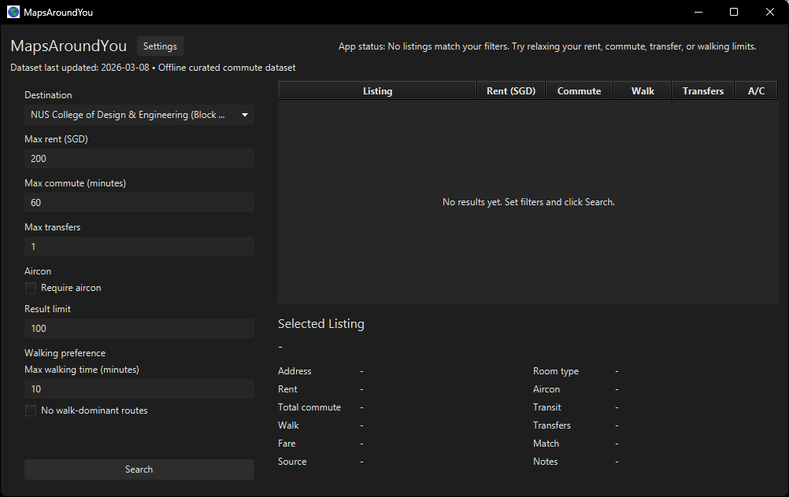

# MapsAroundYou User Guide

MapsAroundYou is an **offline smart rental search** app that helps you shortlist rental listings using a bundled local dataset (listings + precomputed commute times). It’s for users who want **fast, repeatable filtering** (rent/commute/walk/aircon) without relying on live APIs.


This document is the **canonical end-user User Guide** for MapsAroundYou. It focuses on how to run and use the app (GUI + CLI), not on developer internals or data generation.

> [!TIP]
> Watch the demo before your first run: [MapsAroundYou Demo Video](https://youtu.be/_u43spy3ggE)

## Table of Contents

- [Quick Start](#quick-start)
- [Common task flows](#common-task-flows)
- [CLI command reference](#cli-command-reference)
- [Features](#features)
  - [Notes about usage formats (GUI & CLI)](#notes-about-usage-formats-gui--cli)
  - [GUI: Run a search and view results](#gui-run-a-search-and-view-results)
  - [GUI: View listing details](#gui-view-listing-details)
  - [GUI: Settings (persona preset, dark mode)](#gui-settings-persona-preset-dark-mode)
  - [CLI: Interactive mode](#cli-interactive-mode)
  - [CLI: Flag-driven search](#cli-flag-driven-search)
  - [CLI: Help](#cli-help)
- [End-to-end usage scenario](#end-to-end-usage-scenario)
- [Troubleshooting](#troubleshooting)
- [FAQ](#faq)
- [Known Issues](#known-issues)
- [Glossary](#glossary)
- [Summary / Cheat Sheet](#summary--cheat-sheet)

## Quick Start

### 1) Prerequisites

- **Java**: Java **21** or newer installed and available via `PATH` or `JAVA_HOME`.
- **OS**: Windows, macOS, and Linux are supported for normal builds.
- **No separate Gradle install needed**: the repo includes the Gradle wrapper (`gradlew` / `gradlew.bat`).

> [!IMPORTANT]
> The GUI uses JavaFX. **Windows ARM64 is not supported natively by JavaFX**; see [Known Issues](#known-issues).

### 2) Get the app

Clone or download the repository, then open a terminal in the repository root.

### 3) Run the GUI (JavaFX)

**Windows (PowerShell):**

```powershell
.\gradlew run
```

**macOS/Linux (bash/zsh):**

```bash
./gradlew run
```

### 4) Run the CLI

**Windows (PowerShell):**

```powershell
.\gradlew runCli
```

**macOS/Linux:**

```bash
./gradlew runCli
```

### 5) First launch: what you should see

- **GUI**: A window titled **“MapsAroundYou”** with
  - a destination picker,
  - filter inputs (rent/commute/transfers/walk/aircon/result limit),
  - a **Search** button,
  - a results table (initially empty),
  - a details panel for the selected listing,
  - a dataset label such as “Data accurate as of …”.

   
- **CLI**: A banner “MapsAroundYou CLI” plus dataset provenance, then either:
  - **interactive prompts**, or
  - structured command handling if you pass arguments.

### 6) Try these quick actions

- **GUI**:
  1. Choose a destination.
  2. Enter `max rent` and `max commute`.
  3. Click **Search**.
  4. Click a row to see details.

   
- **CLI**:
  1. Run `.\gradlew runCli`.
  2. Enter a destination id such as `D01` when prompted.
  3. Press **Enter** to accept defaults in brackets for the other prompts.
  4. Type `exit` at the destination prompt to quit.

## Common task flows

These walkthroughs focus on the most common goals first-time users have: finding affordable options that still “work”, optimizing for commute time, and recovering when filters are too strict.

> [!TIP]
> The same filters exist in both the GUI and CLI (destination, rent, commute, transfers, walking, aircon, result limit, sorting, and optional walk-dominant exclusion). Use whichever interface you prefer.

### A) Find the cheapest acceptable listing

Goal: get the **lowest rent** you can accept **without accidentally choosing an impractical commute**.

1. Choose a **Destination** (the place you want to commute to).
   - **GUI**: pick from the Destination dropdown.
   - **CLI**: choose an ID from “Supported destinations” (e.g., `D01`).
2. Set a “must-work” commute cap first (so you don’t optimize rent at the cost of daily travel).
   - Start with something realistic for you (example: **45 minutes**).
   - **GUI**: set **Max commute (minutes)**.
   - **CLI**: set `Max commute (minutes)` (interactive) or `--max-commute`.
3. Set your rent cap next.
   - Example starting point: **SGD 1800**.
   - **GUI**: set **Max rent (SGD)**.
   - **CLI**: set `Max rent (SGD)` or `--max-rent`.
4. Reduce “nice-to-have” filters temporarily (optional, but often helpful for first searches).
   - If you don’t want transfers to be a deciding factor yet:
     - **GUI**: leave **Max transfers** blank to mean **No limit**.
     - **CLI**: set **Max transfers** high (so you’re not filtering by interchange count).
   - Consider leaving **Require aircon** unchecked on your first pass unless it’s a must-have.
   - Consider leaving **No walk-dominant routes** off initially if you’re unsure what it excludes.
5. Sort for rent so the cheapest acceptable options surface first.
   - **GUI**: click the **Rent (SGD)** column header so it sorts ascending.
   - **CLI**: use `--sort rent` (or pick `rent` at the sort prompt).
6. Run the search.
   - **GUI**: click **Search**. Expect **“Searching…”** then **“Found N result(s).”**
   - **CLI**: expect a printed **Top matches** list.
7. Compare the top few listings using rent *and* commute attributes.
   - Start with **Rent (SGD)** and **Commute** (total minutes).
   - Then sanity-check **Walk** and **Transfers** to avoid “cheap but annoying” commutes.
   - If two options have similar rent, prefer the one with lower walk time / fewer transfers (all else equal).
8. Inspect details before deciding.
   - **GUI**: click a row and review the **Selected Listing** panel (rent, total/transit/walk, transfers, fare, and **Match**).
   - **CLI**: read the line with commute breakdown `(... transit / ... walk)` and the printed score.

If you get **no results**, try this order:

1. Increase **Max rent** a little (e.g., `1800` → `2000`), search again.
2. If still empty, increase **Max commute** (e.g., `45` → `55`).
3. If still empty, loosen commute “friction” limits: raise **Max transfers** and/or **Max walking time**.
4. If still empty, turn off stricter toggles like **Require aircon** and **No walk-dominant routes** (if enabled).

### B) Prioritize the shortest commute

Goal: find listings with the **lowest travel time** first, and understand the trade-offs (often higher rent or more walking).

1. Choose your **Destination**.
2. Set a commute-focused maximum that reflects your hard limit.
   - Example: **35 minutes** (or whatever you consider “short”).
3. Set a rent cap that keeps results realistic, but not so low that commute optimization becomes impossible.
   - Example: set a cap, but be ready to adjust it upward if commuting fast costs more.
4. Prefer filters that reduce day-to-day commute friction:
   - Set **Max transfers** to something you can tolerate (example: `1`).
   - Set **Max walking time** to your comfort level (example: `10`).
   - If you want routes that are mostly public transport rather than long walks, enable **No walk-dominant routes**.
5. Sort for commute.
   - **GUI**: click the **Commute** column header to sort ascending.
   - **CLI**: use `--sort commute` (or pick `commute` at the sort prompt).
6. Run the search and review the top results.
   - **First check**: total commute minutes (lowest is best for this goal).
   - **Then check**: walk minutes and transfers—two commutes with the same total time can feel very different.
7. Inspect details for the top 1–3 results before deciding.
   - **GUI**: click each and compare the **Total commute**, **Transit**, **Walk**, and **Transfers** lines in the details panel.
   - **CLI**: compare `Commute: ... min (... transit / ... walk)` across results.

Typical trade-offs you may see:

- **Higher rent** for shorter commutes.
- **More walking** even when total time is low.
- **Fewer transfers** may increase total time (depending on routes).

### C) Broaden results when filters are too strict

If you see **0 results** (GUI status message or CLI “no listings match” message), your filters are filtering everything out. Broaden in a practical order so you keep control of what changes.

1. Increase **Result limit** (if you’re only seeing a few results but want more variety).
   - Example: `5` → `10` or `20`.
   - What you should see: more rows printed/shown (up to the limit), while still respecting your filters.
2. Increase **Max rent** in small steps.
   - Example: `1800` → `2000` → `2200`.
   - Why: rent caps often eliminate many otherwise-good commute options.
3. Increase **Max commute** slightly.
   - Example: `35` → `45` → `55`.
   - Why: commute limits are a hard cutoff; a small bump can unlock many listings.
4. Relax “friction” constraints:
   - Increase **Max transfers** (example: `1` → `2`).
   - Increase **Max walking time** (example: `10` → `15`).
   - Why: a strict transfer/walk limit can remove routes that are still acceptable overall.
5. Turn off stricter toggles if they’re not essential:
   - Uncheck **Require aircon** (if it’s a preference, not a requirement).
   - Uncheck **No walk-dominant routes** (if you’d rather see everything and decide manually).
6. Re-run the search after each change (one change at a time).
   - What you should see: either results start appearing, or you learn which constraint is doing the most filtering.

## CLI command reference

MapsAroundYou’s CLI supports **three** entry flows:

- **Interactive mode**: run with **no arguments**.
- **Flag-driven search**: run `search` with required flags.
- **Help**: run `--help` / `-h` / `help` (or `search --help`).

### Commands

#### Interactive mode (default)

- **Windows**: `.\gradlew runCli`
- **macOS/Linux**: `./gradlew runCli`

Interactive mode prints:

- **Supported destinations** list
- `Interactive mode` instructions
- A sequence of prompts (see [CLI: Interactive mode](#cli-interactive-mode))

Exit by typing `exit` or `quit` at:

- the **Destination ID** prompt, or
- the **“Press Enter to search again or type exit”** prompt

#### `search` (one-off search)

Run one search and print results, then exit.

**Required flags**

- `--destination <ID>`
- `--max-rent <SGD>` (integer, \( \ge 0 \))
- `--max-commute <minutes>` (integer, \( \ge 1 \))

**Optional flags**

- `--max-transfers <count>` (integer, \( \ge 0 \); if omitted, uses your saved/default preference)
- `--max-walk <minutes>` (integer, \( \ge 0 \); if omitted, uses your saved/default preference)
- `--result-limit <count>` (integer, \( \ge 1 \); if omitted, uses your saved/default preference)
- `--sort <commute|rent|balanced>` (if omitted, uses your saved/default preference)
- `--require-aircon` (switch; if present, requires aircon)
- `--exclude-walk-dominant` (switch; if present, excludes walk-dominant routes)

**Exit codes**

- `0`: success (including “no results”)
- `1`: user error (unknown command/flag, missing required flag, invalid values, unknown destination) or unexpected failure

#### Help

All of these print usage text:

- **Windows:** `.\gradlew runCli -PcliArgs="--help"`
- **macOS/Linux:** `./gradlew runCli -PcliArgs="--help"`
- **Windows:** `.\gradlew runCli -PcliArgs="-h"`
- **macOS/Linux:** `./gradlew runCli -PcliArgs="-h"`
- **Windows:** `.\gradlew runCli -PcliArgs="help"`
- **macOS/Linux:** `./gradlew runCli -PcliArgs="help"`
- **Windows:** `.\gradlew runCli -PcliArgs="search --help"`
- **macOS/Linux:** `./gradlew runCli -PcliArgs="search --help"`

## Features

### Notes about usage formats (GUI & CLI)

#### GUI conventions

- **Required vs optional**:
  - Destination must be selected before searching.
  - Other fields are validated; invalid input shows an error in the status bar.
  - In the GUI, leaving **Max transfers** blank means **No limit** rather than an error.
- **Where results appear**:
  - Results show in a table with columns **Listing**, **Rent (SGD)**, **Commute**, **Walk**, **Transfers**, and **A/C**.
  - When you click a row, the **Selected Listing** panel shows the full details including **Match**.
- **What “Match” means**:
  - **Match** is a **fit indicator** for your current filters. It is computed from the listing’s **rent** and **commute time**, relative to the maximum values you entered.
  - A high Match usually means the listing is **comfortably under** your max rent and max commute (more “headroom”), not just barely passing.
  - Use it to **compare** similar listings at a glance, but still check the actual numbers (rent, commute, walking, transfers) before deciding.

#### CLI conventions

- Words in `<>` are values you provide.
- Flags starting with `--` are named options.
- In **interactive mode**, pressing **Enter** keeps the bracketed default.
- To quit interactive mode, type `exit` or `quit` when prompted.

---

### GUI: Run a search and view results

Runs an offline search using your selected destination and filters, then shows ranked matches.

**How to use**

1. Start the GUI:

   ```powershell
   .\gradlew run
   ```

2. In the left panel:
   - Choose a **Destination**.
   - Fill in filters such as:
     - **Max rent (SGD)**
     - **Max commute (minutes)**
     - **Max transfers**
     - **Result limit**
     - **Max walking time (minutes)**
     - **Require aircon**
     - **No walk-dominant routes**
3. Click **Search**.
4. (Optional) Control the sort:
   - Click **Rent (SGD)** to sort by rent (ascending).
   - Click **Commute** to sort by commute time (ascending).
   - Clear sorting (back to “Balanced”) by clicking the sorted column header until the sort indicator disappears.

**Expected behavior**

- While searching, inputs are temporarily disabled and the status shows **“Searching…”**.
- When finished:
  - the results table is populated,
  - the status shows **“Found N result(s).”**,
  - the dataset label reflects the dataset provenance/last updated date.



- If a field is invalid (e.g., not a number), the status shows a user-facing error message and the search does not run.



**Examples**

- A basic search:
  - Destination: choose any supported destination from the dropdown
  - Max rent: `1800`
  - Max commute: `45`
  - Result limit: `10`
  - Click **Search**

**Tips / warnings**

- **Max transfers**:
  - **GUI**: leave the field blank for **No limit**.
  - **CLI**: set a high value if you don’t want to filter by interchange count (the CLI help explicitly suggests this).
- **No walk-dominant routes**: filters out results where **walking makes up most of the commute** (specifically, walking is **60% or more** of the total commute time). Enable this if you want routes that are primarily public transport rather than long walks.

---

### GUI: View listing details

Shows more information about a listing you select from the results table.

**How to use**

1. Run a search.
2. Click a row in the results table.

**Expected behavior**

- The “Selected Listing” panel updates with details such as:
  - Address, room type, rent, aircon
  - Commute summary
  - Match score
  - Source platform and notes (if available)

**Examples**

- After searching, click the first row. The details panel should populate immediately.

---

### GUI: Settings (persona preset, dark mode)

The GUI includes lightweight settings for onboarding and appearance.

**How to use**

1. Click **Settings** in the top bar.
2. In the settings window:
   - Choose a **Persona preset** (`Student` or `Worker`).
   - Toggle **Dark mode** on/off.
3. Click **Close**.

**Expected behavior**

- **Persona preset** pre-fills **Max rent**, **Max commute**, and **Require aircon** with typical defaults for that persona. You can always override the fields after the preset is applied.
  - **Student**: max rent `1400`, max commute `50`, require aircon `off`
  - **Worker**: max rent `2000`, max commute `65`, require aircon `off`
- **Dark mode** applies a dark theme stylesheet to the UI.
- These settings are saved best-effort using Java’s `Preferences` store (OS-specific).



**Examples**

- Turn on **Dark mode** and close Settings. The app stays in dark mode for future launches (unless the OS blocks preference writes).

---

### CLI: Interactive mode

Interactive mode prompts you for search preferences and allows repeated searches until you exit.

**How to use**

1. Start the CLI:

   ```powershell
   .\gradlew runCli
   ```

2. Follow prompts for:
   - Destination ID (type `exit` to quit)
   - Max rent (SGD)
   - Max commute (minutes)
   - Max transfers
   - Max walking time (minutes)
   - Require aircon? (`y`/`n`)
   - Result limit
   - Sort mode (`commute`, `rent`, `balanced`)
   - Exclude walk-dominant routes? (`y`/`n`)
3. After results print, press Enter to search again or type `exit`.

**Expected behavior**

- The CLI prints a “Supported destinations” list first.
- Pressing **Enter** accepts the value in brackets.
- The destination prompt is shown as `Destination ID [<default>]:`.
- The sort prompt is shown as `Sort mode (commute/rent/balanced) [<default>]:`.
- A successful search prints a ranked list including rent, commute breakdown (transit/walk), address, room type, and score.
- If a search yields no matches, the CLI prints a “no results” message and continues.

**Examples**

A typical interactive session looks like this (prompts abbreviated):

```text
Destination ID [D01]:
Max rent (SGD) [1800]:
Max commute (minutes) [45]:
...
Press Enter to search again or type exit:
```

---

### CLI: Flag-driven search

Runs a single search using a structured command.

**How to use**

**Windows (PowerShell):**

```powershell
.\gradlew runCli -PcliArgs="search --destination D01 --max-rent 2200 --max-commute 45 --max-transfers 1 --max-walk 10 --result-limit 5 --sort balanced --require-aircon --exclude-walk-dominant"
```

**macOS/Linux (bash/zsh):**

```bash
./gradlew runCli -PcliArgs='search --destination D01 --max-rent 2200 --max-commute 45 --max-transfers 1 --max-walk 10 --result-limit 5 --sort balanced --require-aircon --exclude-walk-dominant'
```

**Supported flags**

- `--destination <ID>` *(required)*
- `--max-rent <SGD>` *(required; integer ≥ 0)*
- `--max-commute <minutes>` *(required; integer ≥ 1)*
- `--max-transfers <count>` *(optional; integer ≥ 0)*
- `--max-walk <minutes>` *(optional; integer ≥ 0)*
- `--result-limit <count>` *(optional; integer ≥ 1)*
- `--sort <commute|rent|balanced>` *(optional)*
- `--require-aircon` *(optional switch)*
- `--exclude-walk-dominant` *(optional switch)*

**Expected behavior**

- If you omit an optional flag, the CLI reuses your current stored preference for that field.
- Unknown commands or flags print an error message to stderr (prefixed with `Error:`) plus help text.
- If you pass `search --help`, the CLI prints help (same as `help`).

**Examples**

- Fast commute, limit results, no aircon requirement:

```powershell
.\gradlew runCli -PcliArgs="search --destination D05 --max-rent 1800 --max-commute 35 --result-limit 10 --sort commute"
```

---

### CLI: Help

Prints usage and examples.

**How to use**

```powershell
.\gradlew runCli -PcliArgs="--help"
```

or

```powershell
.\gradlew runCli -PcliArgs="help"
```

## End-to-end usage scenario

This section shows realistic “shortlist apartments for commute + rent” flows end-to-end.

### Scenario: shortlist rentals using the GUI

This walkthrough is written for a first-time user who wants to quickly narrow down rentals, then widen/tighten constraints based on the results.

1. Launch the GUI:

   ```powershell
   .\gradlew run
   ```

   **Expected behavior**: A window titled **“MapsAroundYou”** opens, with a left-side filter panel, a results table (initially empty), and a **Selected Listing** details panel.

2. Choose a destination in **Destination** (dropdown).

   **Expected behavior**: The destination selection becomes active (you can search once a destination is selected).

3. Enter a practical first-pass set of constraints in the left panel. For example:

   - Max rent (SGD): `1800`
   - Max commute (minutes): `45`
   - Max transfers: `1`
   - Max walking time (minutes): `10`
   - Require aircon: checked
   - Result limit: `10`
   - No walk-dominant routes: checked

   **Why this helps**: This combination finds places that fit your budget and a reasonable daily commute, while excluding routes that are mostly walking.

4. Click **Search**.

   **Expected behavior**:
   - The app status changes to **“Searching…”** and the inputs are temporarily disabled.
   - When finished, the status shows **“Found N result(s).”** and the results table fills with matching listings.

5. Review the results table to spot promising options.

   - Use the **Commute**, **Walk**, and **Transfers** columns to quickly rule out impractical routes.
   - Use **Rent (SGD)** and **A/C** to confirm the listing meets your “must-haves”.

   **Expected behavior**: If there are results, the first row is auto-selected and the details panel updates.

6. Click a specific row to inspect it.

   **Expected behavior**: The **Selected Listing** panel shows:
   - Address, room type, rent, aircon
   - Commute breakdown (total / transit / walk / transfers / fare)
   - **Match** (shown as a percentage)
   - Source platform and notes (if available)

7. Refine or broaden your shortlist by adjusting one constraint and searching again.

   Pick the change that matches what you learned from the first run:

   - If you got **too few results**: increase **Max rent** (e.g., `1800` → `2000`) or **Max commute** (e.g., `45` → `55`), then click **Search** again.
   - If you got **too many results**: lower **Result limit** (e.g., `10` → `5`), reduce **Max walking time**, or require fewer **Max transfers**, then click **Search** again.

   **Expected behavior**: The results table refreshes to reflect the new constraints, and the details panel updates to the newly selected result.

### Scenario: shortlist close-to-commute rentals (CLI)

1. Launch interactive CLI:

   ```powershell
   .\gradlew runCli
   ```

2. Pick a destination ID from the printed “Supported destinations” list, then enter your constraints:
   - Destination ID: `D01`
   - Max rent: `1800`
   - Max commute: `35`
   - Max transfers: `1`
   - Max walking time: `10`
   - Require aircon: `y`
   - Result limit: `10`
   - Sort mode: `commute`
   - Exclude walk-dominant routes: `n`

3. Expected output shape (example):

```text
MapsAroundYou CLI
Offline smart rental search scaffold
Data accurate as of 2026-03-08 | Fixture dataset

Supported destinations:
  D01  NUS                                                    (University)

Interactive mode
Type 'exit' at the destination prompt to quit.
Press Enter to keep the value shown in brackets.
You can leave max transfers high to avoid filtering by interchange count.

Top matches:
1. Fixture Listing [L001]
   Rent: SGD 1500 | Commute: 30 min (20 transit / 10 walk) | Aircon: Yes
   Address: 123 Demo Street | Type: HDB room | Score: 0.50
```

4. If the results look too restrictive, loosen a constraint (e.g., increase max rent or max commute) and search again.

## Troubleshooting

### Common errors and what they mean

This section translates common symptoms into plain-language causes and next steps. (If you see a specific `Error:` line in the CLI, you can still use it to match the relevant case below.)

- **Problem:** Search does not run after clicking **Search** (GUI).
  - **Likely cause:** A required field is missing or invalid (for example, destination not selected, a blank required numeric field such as **Max rent**, or a non-integer like `45.5`).
  - **What to do:** Pick a destination and ensure numeric fields contain **whole numbers**. In the GUI, **Max transfers** is the exception: leaving it blank means **No limit**. Common messages include “Please choose a destination.”, “\<Field\> is required.”, and “\<Field\> must be a valid integer.”

- **Problem:** GUI status says “Max commute must be at least 1.” (or similar “must be at least …”).
  - **Likely cause:** You entered a value below the minimum allowed.
  - **What to do:** Use these minimums:
    - Max commute: \( \ge 1 \)
    - Result limit: \( \ge 1 \)
    - Max rent / transfers / walking time: \( \ge 0 \)

- **Problem:** CLI says `Error: Missing required flag: --destination` (or `--max-rent`, `--max-commute`).
  - **Likely cause:** The `search` command needs required flags and values.
  - **What to do:** Include all required flags for `search`: `--destination`, `--max-rent`, and `--max-commute`.

- **Problem:** CLI says `Error: Unknown command: ...` or `Error: Unknown flag: ...`.
  - **Likely cause:** A typo, unsupported command, or using a flag that doesn’t exist.
  - **What to do:** Run help and copy an example:
    - `.\gradlew runCli -PcliArgs="--help"`
    - Then use `search ...` with the documented flags only.

- **Problem:** CLI says `Error: Missing value for flag: --max-rent` (or similar).
  - **Likely cause:** You typed a value-flag but didn’t include the value after it.
  - **What to do:** Ensure every value flag is followed by a value, e.g. `--max-rent 1800`.

- **Problem:** CLI says `Error: --max-commute must be a valid integer.` (or `Max rent (SGD) must be a valid integer.` in interactive mode).
  - **Likely cause:** The app only accepts whole numbers for numeric fields.
  - **What to do:** Remove commas/decimals and enter integers only (example: `1800`, not `1,800` or `1800.0`).

- **Problem:** CLI says `Error: Unknown sort mode: ...`.
  - **Likely cause:** Sort mode must be one of the supported tokens.
  - **What to do:** Use exactly one of: `commute`, `rent`, `balanced`.

- **Problem:** CLI says `Error: Please answer y/yes or n/no for ...`.
  - **Likely cause:** A yes/no prompt only accepts `y/yes` or `n/no` (case-insensitive).
  - **What to do:** Enter `y` or `n` (or press Enter to accept the bracketed default).

- **Problem:** Search returns “No listings match your filters…” (GUI or CLI).
  - **Likely cause:** Your filters are collectively too strict for the dataset.
  - **What to do:** Follow [Broaden results when filters are too strict](#c-broaden-results-when-filters-are-too-strict). A good first adjustment is increasing **Max rent** or **Max commute** slightly, then re-run the search.

- **Problem:** CLI interactive mode ends early with `Interactive mode ended before all inputs were provided.` (often when piping input).
  - **Likely cause:** The app reached end-of-input before it could read all prompts.
  - **What to do:** Run without piping input, or ensure your piped input contains lines for every prompt.

- **Problem:** GUI shows “Failed to load dataset: ...” or a window that says “Startup error: ...”.
  - **Likely cause:** The bundled dataset files are missing, unreadable, or invalid.
  - **What to do:** Verify you are running from a complete project checkout and did not remove bundled data under `src/main/resources/commute_data/`. If needed, run `.\gradlew clean check` to surface build/runtime issues.

### The CLI prints an error and shows help

If the CLI can’t parse your command, it prints a single-line error to stderr prefixed with `Error:` and then prints help.

Common fixes:

- **Unknown command** (`Error: Unknown command: ...`): use `help` or `search`.
- **Unknown flag** (`Error: Unknown flag: ...`): check spelling (e.g., `--max-rent`, not `--max-rentt`).
- **Missing required flag** (`Error: Missing required flag: --destination`): ensure you passed all required flags for `search`.
- **Missing value for a flag** (`Error: Missing value for flag: --max-rent`): every value-flag must be followed by a value.
- **Invalid integer** (`Error: --max-commute must be a valid integer.`): only whole numbers are accepted.
- **Out-of-range values**:
  - `--max-commute` must be at least 1
  - `--max-rent`, `--max-transfers`, `--max-walk` must be at least 0
  - `--result-limit` must be at least 1

### Interactive mode ended early (piped input / missing lines)

If you see:

- `Error: Interactive mode ended before all inputs were provided.`

Run again and provide a full set of inputs, or avoid piping incomplete stdin.

### Startup error (dataset failed to load)

If you see:

- `Startup error: ...`

Try:

1. Run the quality gate to surface build/runtime issues:

   ```powershell
   .\gradlew clean check
   ```

2. Ensure you didn’t delete or move the bundled dataset under `src/main/resources/commute_data/`.

### The GUI won’t start

First confirm Java 21+ and then try `.\gradlew run`. If you are on Windows ARM64, see [Known Issues](#known-issues).

## FAQ

### Where does MapsAroundYou get its data?

From bundled files under:

- `src/main/resources/commute_data/`

This includes destinations, listings, and a precomputed public-transport travel time matrix. The app does **not** call live APIs at runtime.

### How do I know how fresh the data is?

Both the GUI and CLI show dataset provenance based on:

- `src/main/resources/commute_data/dataset-metadata.properties`

### Where are my search preferences saved?

Last-used search preferences are stored locally at:

- `<user-home>/.mapsaroundyou/user-preferences.properties`

If the file is missing or invalid, the app safely falls back to defaults.

### Where are GUI settings (dark mode / persona) saved?

GUI settings are stored using Java’s `Preferences` (OS-managed storage). On Windows this is typically backed by the registry; on macOS/Linux it’s stored in OS-specific preference locations. If preference writes are blocked, the GUI still works but may not remember these settings.

### How do I reset my saved preferences?

- **Search preferences (CLI/GUI search defaults)**: delete
  - `<user-home>/.mapsaroundyou/user-preferences.properties`
- **GUI settings (dark mode/persona)**: clear the Java `Preferences` entries for the app (OS-specific; may require admin tooling).

### The GUI won’t start—what should I try first?

1. Confirm Java 21+:

   ```powershell
   java -version
   ```

2. Run the quality gate to surface build issues:

   ```powershell
   .\gradlew clean check
   ```

3. If you are on Windows ARM64, see [Known Issues](#known-issues).

## Known Issues

- **Windows ARM64 + JavaFX**: JavaFX does **not** support Windows ARM64 natively. If you are running on Windows ARM64, run the app using an **x64 JDK** (or use the CLI-only flow). The GUI launcher prints a concrete example path and a recommended JDK source.

## Glossary

- **Destination**: The place you want to commute to. In the GUI you pick it from a dropdown; in the CLI you provide a destination ID (like `D01`) from the “Supported destinations” list.
- **Match**: A fit indicator for your current search limits. Higher match generally means the listing is more comfortably under your max rent and max commute, but you should still check the actual numbers (rent, commute, walk, transfers).
- **Walk-dominant**: A commute where walking makes up most of the total travel time. If you enable “No walk-dominant routes” / `--exclude-walk-dominant`, the app filters these out.
- **Result limit**: The maximum number of listings shown/printed for a search run.
- **Max transfers**: The maximum number of transfers allowed in the commute. In the GUI, leaving the field blank means **No limit**. In the CLI, use a high value or keep the default if you do not want to filter by interchange count.
- **Max walking time**: The maximum walking minutes allowed within the commute. Increase this if you’re okay with longer walks to unlock more results.
- **Sort mode**: How results are ordered:
  - `rent`: lower rent first
  - `commute`: shorter commute first
  - `balanced`: the default ranking (no explicit rent/commute column sort)
- **Dataset provenance**: The “Data accurate as of …” label shown in both GUI and CLI, indicating when the bundled dataset was last updated and what source description it corresponds to.

## Summary / Cheat Sheet

### GUI

| Action | Where | Result |
|---|---|---|
| Start GUI | `.\gradlew run` | Opens the MapsAroundYou desktop app |
| Run search | Choose destination → fill filters → **Search** | Populates results table and status message |
| View details | Click a result row | Details panel updates |
| Change persona preset | **Settings** → Persona preset | Updates default values |
| Toggle dark mode | **Settings** → Dark mode | Applies dark theme |

### CLI

| Action | Command | Example |
|---|---|---|
| Start interactive CLI | `.\gradlew runCli` | `.\gradlew runCli` |
| Show help | `.\gradlew runCli -PcliArgs="--help"` | `.\gradlew runCli -PcliArgs="help"` |
| Run a one-off search | `.\gradlew runCli -PcliArgs="search ..."` | `.\gradlew runCli -PcliArgs="search --destination D01 --max-rent 2200 --max-commute 45 --sort balanced"` |

